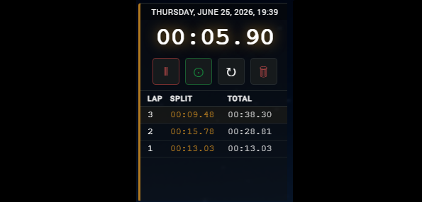
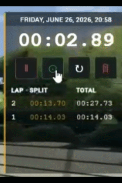
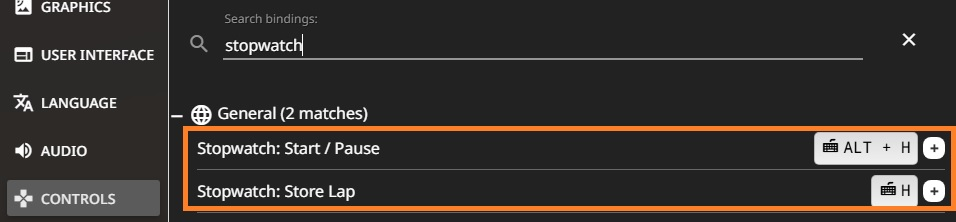
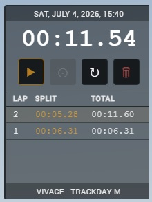

# Simple Stopwatch with Laps - BeamNG.drive UI Mod

A simple manual lap stopwatch with real-world clock display, key inputs and stored laps.



<br/>

## Changelog, Features

**Release V1.0.0 on Friday, June 26, 2026:**

It features the normal stopwatch functions:
- START/PAUSE: to toggle the timer
- STORE LAP time: to capture your current lap split and total session time, and reset the main display to zero for your next lap
- STOP/SOFT RESET timer: to pause and reset to zero the main display without deleting all the stored laps
- TRASH/DELETE: Wipes all the laps and RESETs timer

It also shows at the top the your Local system clock.



<br/>

**Release V1.1.0 on Sunday, June 28, 2026:**

Support for Keyboard/Controller/Wheel Input was added:
- Toggle Start/Pause
- Store Lap, that resets main stopwatch display to 00:00:00 and continues the timer
    - Additional feature: If the timer is stopped and set on 00:00:00, LAP button will start the timer (Useful if you only want 1 button for starting hotlapping)



<br/>

**Release V1.1.1 on Friday, July 03, 2026:**

- Fix disappearing stored laps when user checks the map or the dial menu
- Stored laps are now saved to localStorage

<br/>

**Release V1.2 on Saturday, July 04, 2026:**

- Added car name and model (configuration) in UI



<br/>

**Release V1.3 on Saturday, July 11, 2026:**

- Pause the stopwatch when pausing the game (e.g. via "J" key) or entering the game menu (via "ESC" key). Resume on unpause.

<br/>

## Official Posts in BeamNg forum

https://www.beamng.com/threads/simple-stopwatch-with-laps-and-system-clock.110155/

<br/>

## Installation

For Regular use: Copy the released zip archive into your BeamNG user mods folder, e.g.: `C:\Users\<your_username>\AppData\Local\BeamNG\BeamNG.drive\current\mods`

For Development (Windows): Copy the mod folder or archive into your BeamNG user mods folder:

```
C:\Users\<your_user>\AppData\Local\BeamNG\BeamNG.drive\current\mods\unpacked\
└── simpleStopwatchWithLaps/
    ├── ui/
    │   └── apps/
    │       └── simpleStopwatchWithLaps/
    │           ├── app.html
    │           ├── app.js
    │           ├── app.css
    │           ├── app.json
    |           └── app.png
    ├── lua/
    │   ├── ge/
    │   │   └── extensions/
    │   │       ├── core/input/actions/
    │   │       │   └── swWithLapsInputs.json ← registers bindings in Controls menu
    │   │       └── swWithLaps.lua ← GE-context: receives input, relays to vehicle
    │   └── vehicle/
    │       └── extensions/auto/
    │           └── swWithLaps.lua ← Vehicle-context: sets electrics the UI reads
    └── ui/apps/simpleStopwatchWithLaps/
        └── app.js
```

> **Note:** Do **not** place files directly inside the `BeamNG.drive/` user folder.
>
> For Development: Always use `mods/unpacked/<your-mod-name>/` so BeamNG can load and hot-reload the mod correctly.

<br/>

## Loading the Stopwatch in UI

- Pause the game (ESC)
- Go to "UI Apps"
- Click "Edit Apps"
- Click "Add App"
- Scroll to "General" section
- Double click "Simple Stopwatch with Laps"
- Drag and drop the stopwatch app wherever you want in your screen
- Press ESC or "Back to gameplay"

<br/>

## In-game development debugging

To see the changes in real time in the game while changing this UI App Mod code:

- Open the developer tools with CTRL + U, go to the "Network" tab and check "Disable cache"
- Then press F5

Also, you can press CTRL+L to Reload All LUA scripts (basically all the game) if there are changes to the mod properties.

<br/>

## License

All files in this repository are released under the [GNU General Public License v3 (GPL-3.0)](LICENSE).

Copyright (c) 2026 Radu-Alexandru